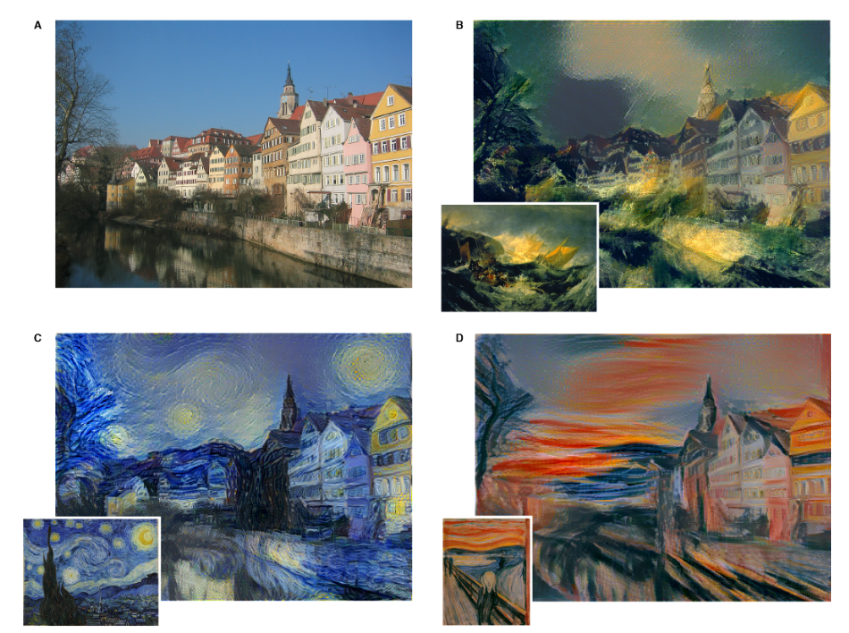
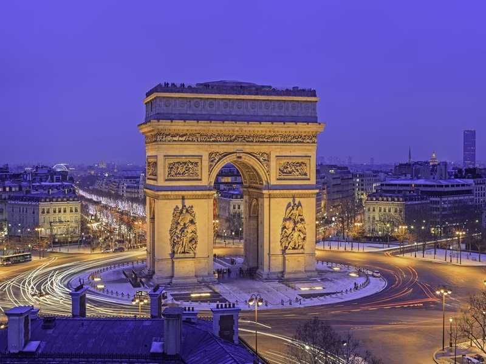
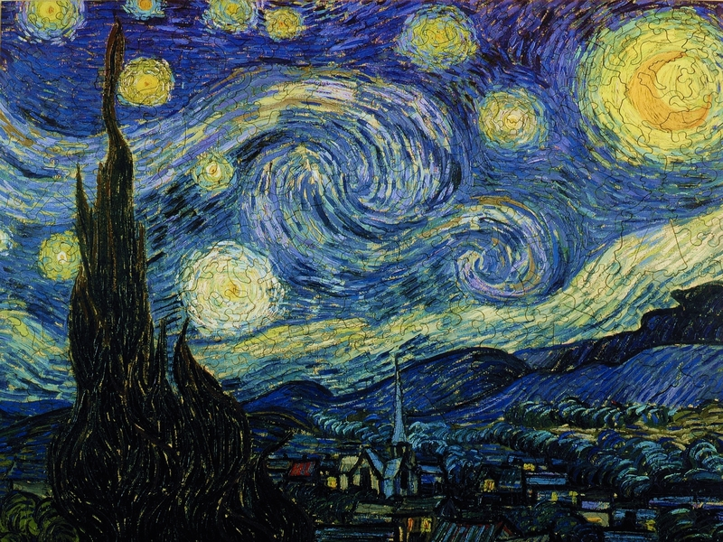
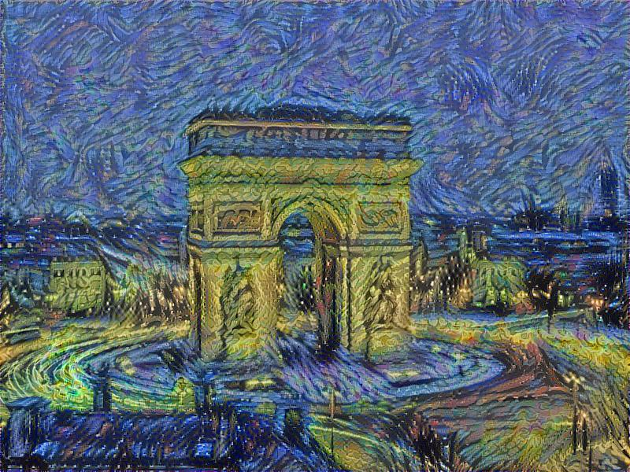
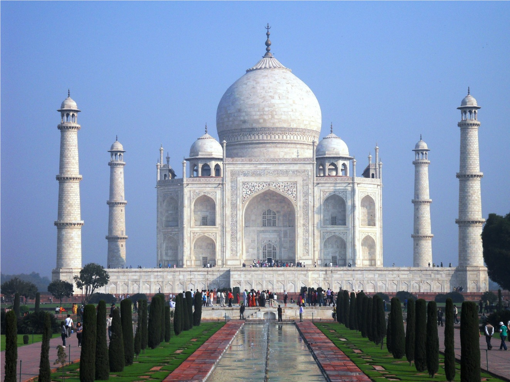
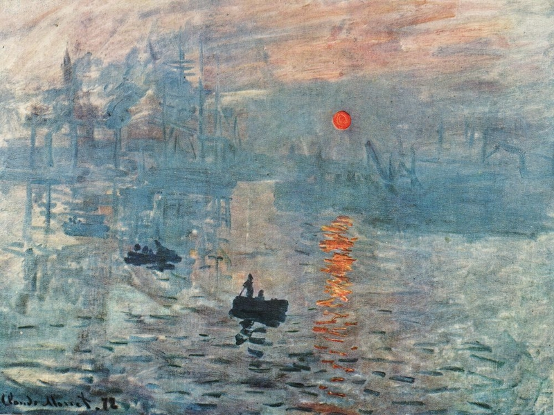
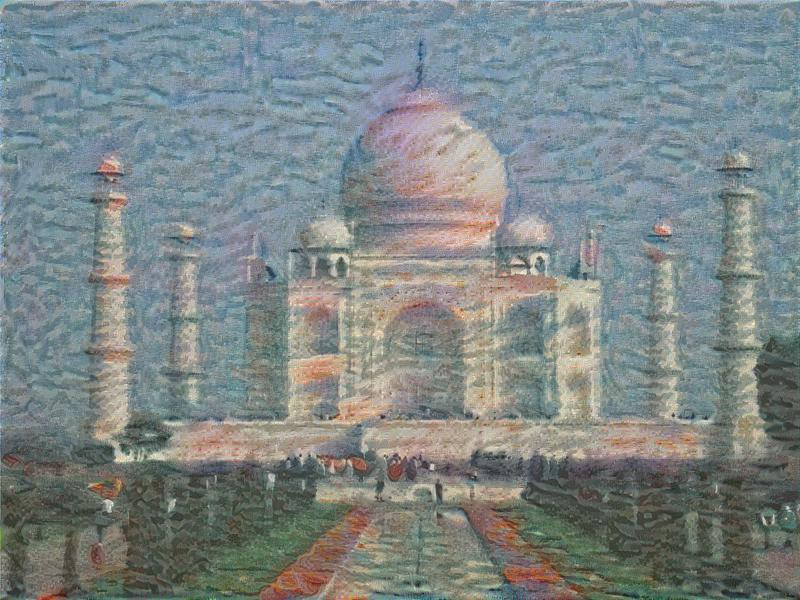
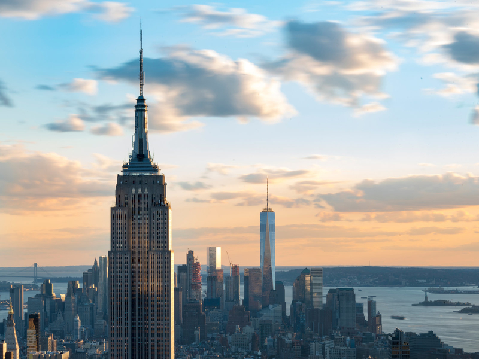
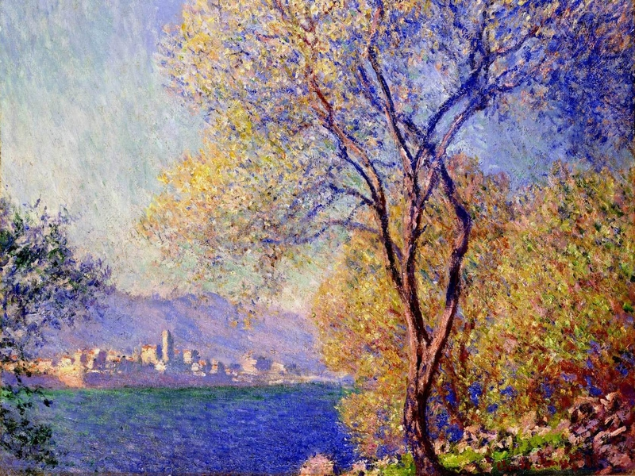
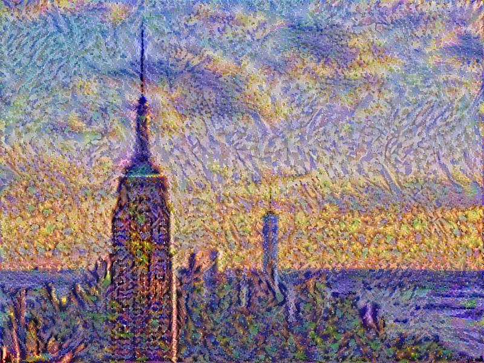

[](https://app.codacy.com/app/pskrunner14/artsy?utm_source=github.com&utm_medium=referral&utm_content=pskrunner14/artsy&utm_campaign=Badge_Grade_Settings)
# Artsy [](https://codeclimate.com/github/pskrunner14/artsy/maintainability)

Artsy is a Neural Style Transfer Art Generation implementation in less than 200 lines of code using TensorFlow. 

Neural Style Transfer is a fairly exciting and fun application of Deep Learning, as it can generate quite genuine and clever looking artistic transmutations of an ordinary photograph by augmenting onto it the artistic style of any painting of your liking. So essentially, we can train a network to transform any image into a stylized version of it, based on the style of our handpicked image. That is incredible! In case you were wondering, this technology is exactly how apps like [Prisma](https://prisma-ai.com/) work.

Here are a few output examples of the “Neckarfront” in Tubingen, Germany in various styles of a few famous impressionist paintings as cited in the NST paper:



## Steps

1. Load the style and content images
1. Randomly initialize the generated image
1. Load the VGG-19 model with the correct configuration
1. Build the computation graph:
    * Run the content image through the VGG-19 model and compute the content cost
    * Run the style image through the VGG-19 model and compute the style cost
    * Compute the total cost
    * Define the optimizer and the learning rate
1. Initialize and run the graph for a number of iterations: 
    * Update the generated image at every step

## Data

*Neural Style Transfer* (NST) uses a previously trained Convolutional Neural Network, and builds on top of that. This concept of using a network trained on a different task (such as *Object Detection and Recognition*) and applying it to a new task is called *Transfer Learning*.

As per the original paper - [A Neural Algorithm of Artistic Style](https://arxiv.org/abs/1508.06576), we will use the *VGG network*. Specifically, we'll use VGG-19, a 19-layer version of the VGG network. This model has already been trained on the very large *ImageNet* database, and thus has learned to recognize a variety of low level features (at the earlier layers) and high level features (at the deeper layers).

The VGG-19 (imagenet-vgg-verydeep-19.mat) model can be downloaded from [here](http://www.vlfeat.org/matconvnet/pretrained/).

## Getting Started

In order to be able to generate neural style artistic images, you will need to install the required python packages:

```
pip install -r requirements.txt
```

Now you can open up a terminal and run the model on your images:

```
python main.py --num-iters 500 --save-every 50
```

Now you are all set up!

## Results

Content: Arc De Triomphe in Paris, France

Style: "The Starry Night" by Vincent van Gogh

<div align="center">
   
   
   
</div>

<br>
<br>

Content: Taj Mahal in Agra, India

Style: Impression, Sunrise by Claude Monet

<div align="center">
   
   
   
</div>

<br>
<br>

Content: New York City skyline

Style: Antibes Seen by Claude Monet

<div align="center">
   
   
   
</div>

## Built With

* Python
* TensorFlow